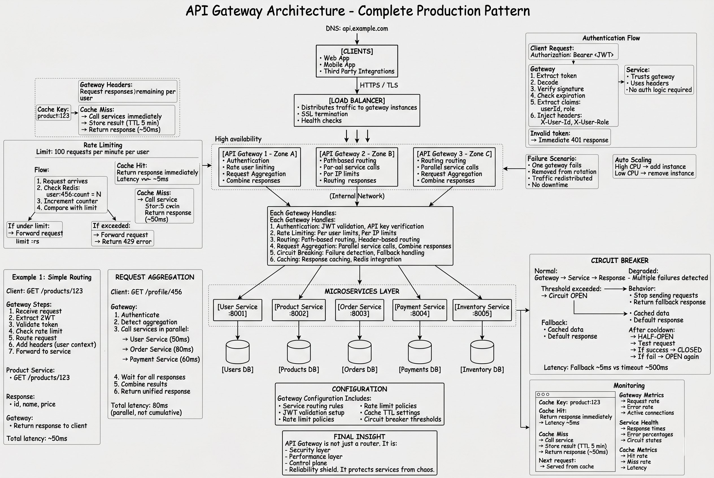

# **API Gateway**

* An API Gateway is a server or service that acts as a single entry point for client requests to various backend services in a microservices architecture or any distributed system.

