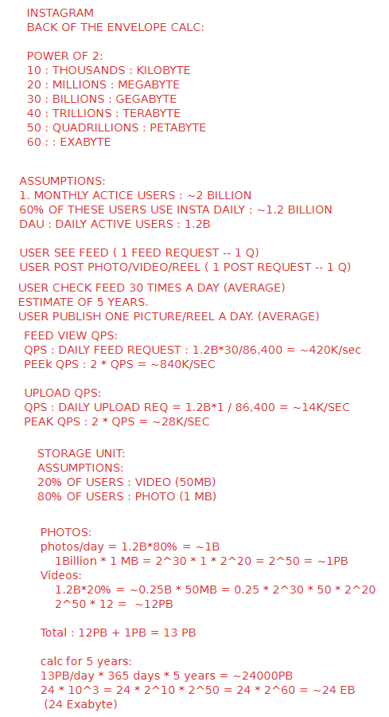

### Back Envelope Calculation

Back-of-the-envelope (BOTEC) calculation refers to a quick and approximate method for estimating values, often used in the early stages of a project or problem-solving.

* **Bandwidth :**
  * The maximum amount of data that can be transmitted through the network in a given time.
* 
* **Steps to Back Envelop Calculation**
  1. Assume DAU (Daily Active Users)
  2. Assume years
  3. Calculate QPS on DB
  4. Calculate Storage
* 
* QPS on DB Calculation
* Storage Unit Calculation
* Bandwidth Calculation
* [https://bytebytego.com/courses/system-design-interview/back-of-the-envelope-estimation](https://bytebytego.com/courses/system-design-interview/back-of-the-envelope-estimation)
* [Video 🔗](https://youtu.be/UC5xf8FbdJc?si=BV1R-2grOmB9uZMF)

QPS - Query per second

DAU - Daily Active Users

