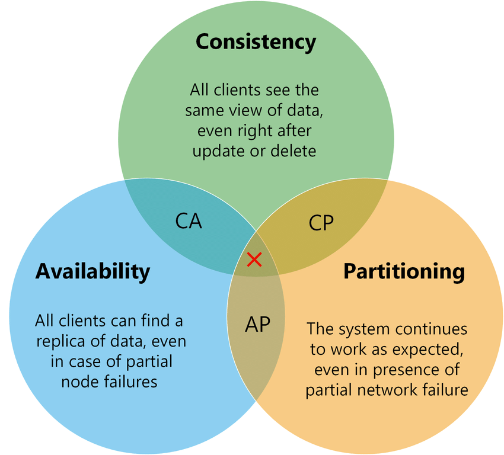

### CAP Theorem

**CAP -** no matter what, you will always get 2 out of these 3. but we always need **P**.

* **C : Consistency -** Clients gets the same data at the same time no matter the db node
* **A : Availability -** Whenever client sends a request he should get a responce
* **P : Partition Tolerance -** Our application should be always up(always operate)

> If we need up to date and correct Responce then we choose Consistency. Like - banking softwares etc.

> If we need only response every time(data will not be correct every time it may be cashed) then we choose Availability. Like-Social Media platforms

