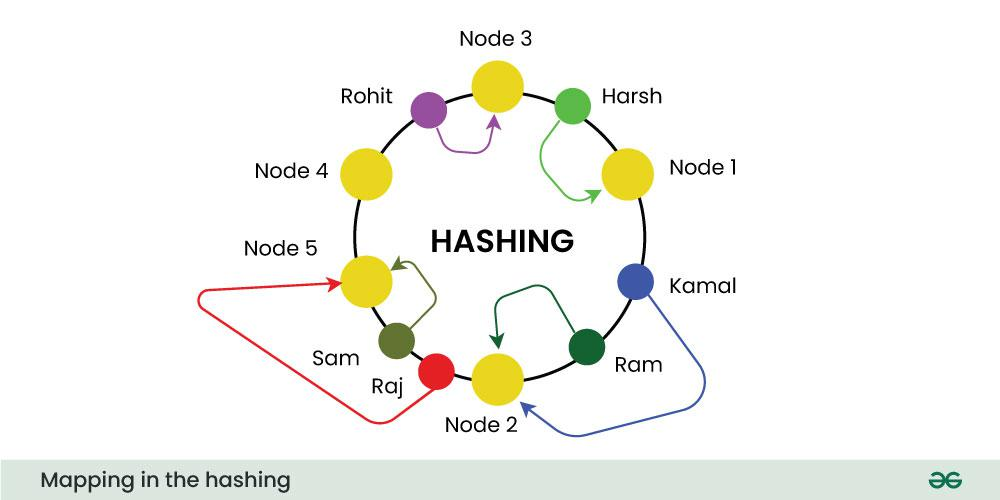
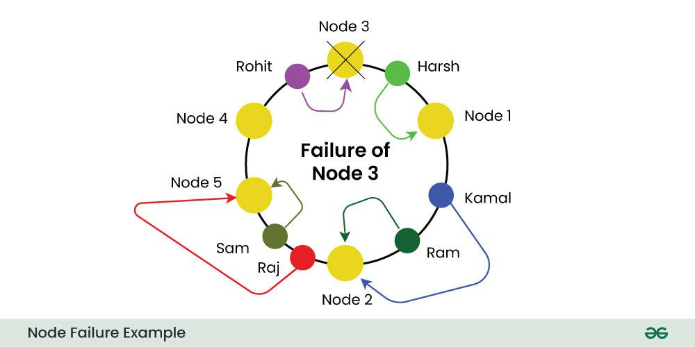

### **Consistent Hashing**

each request can be served by the server node that first appears while traversing clockwise.

* It represents the requests by the system/clients and the server nodes in a virtual ring structure which is known as a  ****hashring**** .
* The number of locations in this ring is not fixed, but it is considered to have an infinite number of points
* The server nodes can be placed at random locations on this ring which can be done using hashing.
* The requests, that is, the users, computers, or serverless programs, are also placed on the same ring using the same hash function.

**How it works**

1. **Hash Function Selection** : Choose a deterministic hash algorithm to map keys to nodes consistently.
2. **Node Assignment** : Assign keys to the nearest node clockwise on a circular ring based on hash values.
3. **Key Replication** : Replicate keys across multiple nodes to ensure data availability during node failures.
4. **Node Addition/Removal** : Remap a minimal number of keys when nodes are added or removed to maintain balance.
5. **Load Balancing** : Distribute keys evenly across nodes, remapping keys from overloaded nodes as needed.
6. **Failure Recovery** : Remap keys from a failed node to other nodes to ensure data availability.

 **Example** : If node 3 fails in a 5-node ring, the next node absorbs its key range, affecting only a small portion of keys.

