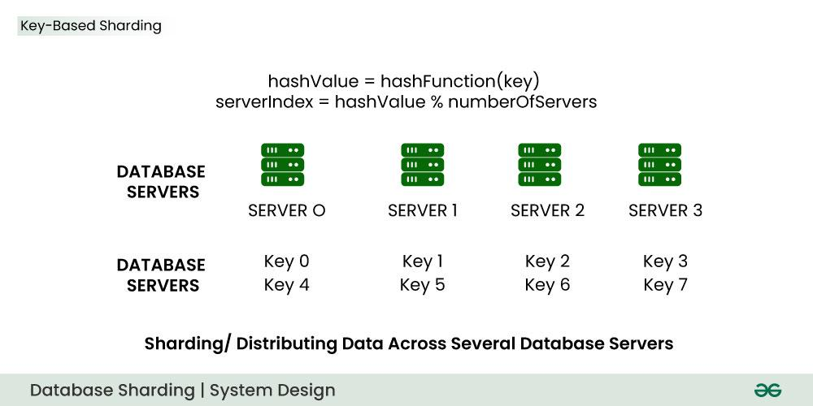
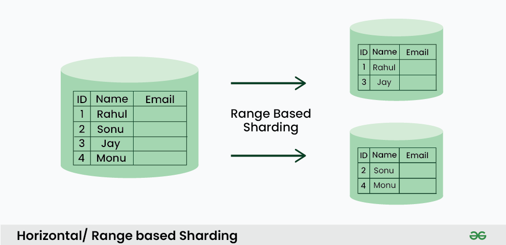
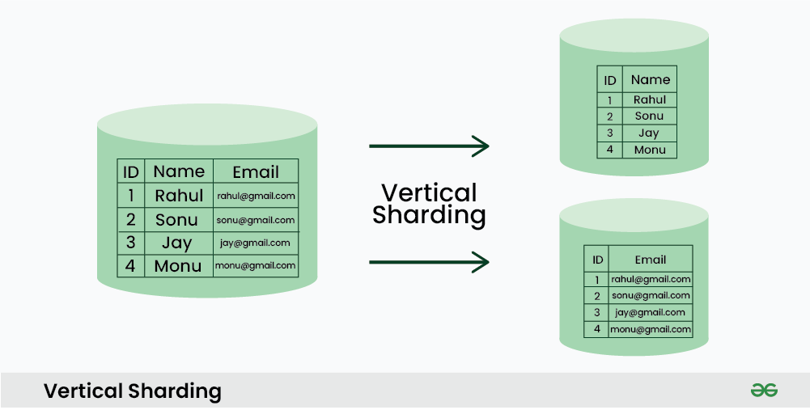
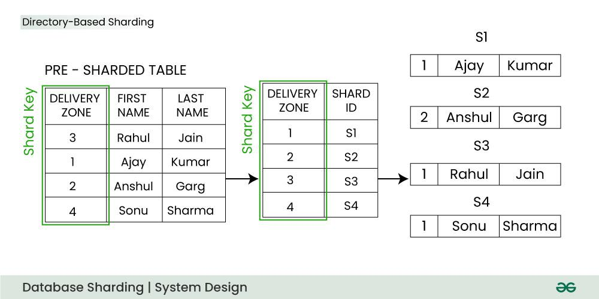

### Database Sharding

****Database sharding**** is a technique for  ****scaling of databases**** , where the data is split across multiple database instances, or shards, to improve performance and reduce the impact of large amounts of data on a single database.

* **Methods Of Sharding**
  1. **Key Based Sharding(Hash Based Sharding):**
     * we take the value of an entity such as customer ID(or any other primary key) and we use this value as an input of the  ****hash function**** . This process generates a ****hash value**** which is used to determine which shard we need to use to store the data.
     * 
     * **Limitations :**
       1. DB Migration is very high
       2. Celibrity ptoblem(Hotspot key problem)
  2. **Horizontal or Range Based Sharding**
     * we divide the data by separating it into different parts based on the range of a specific value within each record.
     * 
     * **Limitations :**
       1. Complex Query
       2. Uneven Data Distribution
  3. **Vertical Sharding**
     * we split the entire column from the table and we put those columns into new distinct tables.
     * 
     * **Limitations :**
       1. Migration is Hard
       2. Celibrity Problem
  4. **DIrectory Bases Sharding :**
     * we create and maintain a ****lookup service**** or lookup table for the original database.
     * 
     * **Limitations :**
       1. Single point of faliure
       2. Increase latency
