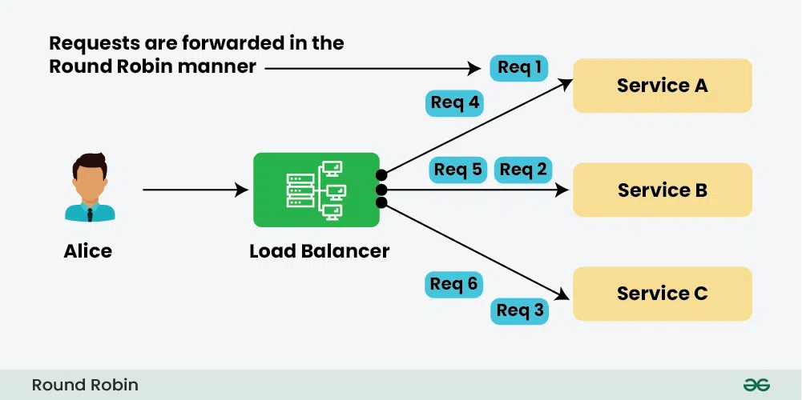
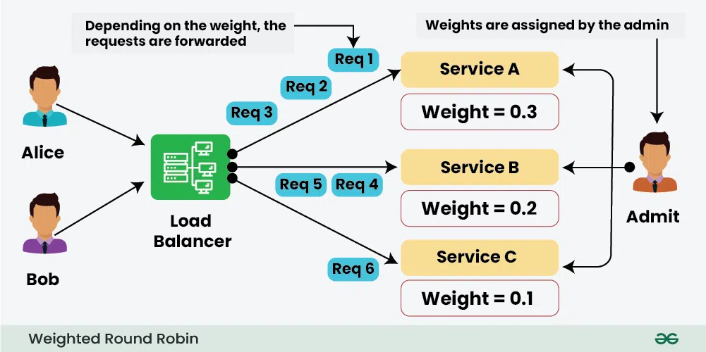
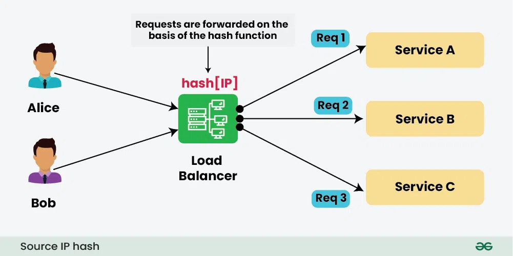
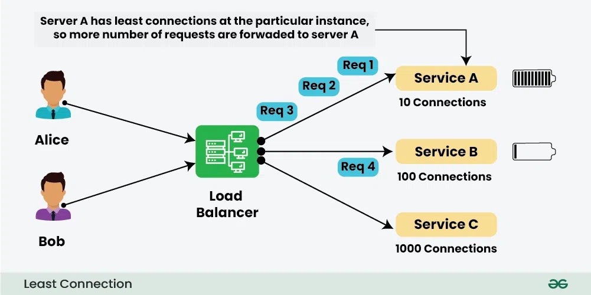
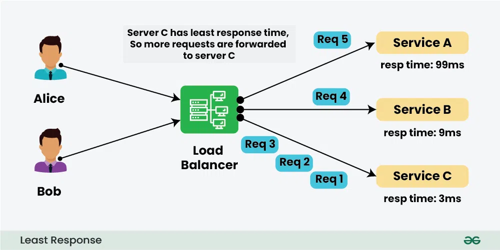
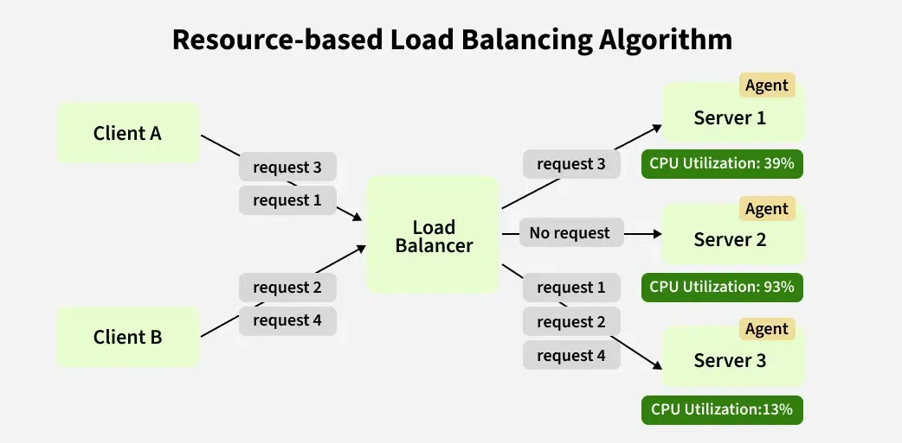

### Load Balancer

 A load balancer is a device or software that distributes network or application traffic across multiple servers to ensure no single server becomes overwhelmed, improving reliability, performance, and scalability.

It acts as a traffic manager, directing requests to available servers based on factors like server health, capacity, or response time.

* **Key Benefits**

  * **High Availability** : Distributes traffic to healthy servers, bypassing failed ones.
  * **Scalability** : Allows adding more servers to handle increased traffic.
  * **Performance** : Reduces server overload, improving response times.
  * **Redundancy** : Ensures uptime by rerouting traffic if a server fails.
  * **Security** : Some load balancers provide features like SSL termination, DDoS protection, or web application firewalls.
  * **Responsiveness :** Thread pool #Need to explore
* **Use Cases**

  * **Web Applications** : Distributing traffic for websites or APIs to ensure fast response times.
  * **Microservices** : Managing traffic across distributed microservices in cloud environments.
  * **Database Clusters** : Balancing queries across database replicas.
  * **Content Delivery** : Optimizing delivery of static and dynamic content.
* **How Does It Work?**

  1. **Receives Requests** : The load balancer receives incoming client requests.
  2. **Distributes Traffic** : It uses algorithms to decide which server should handle each request.
  3. **Forwards Requests** : The request is sent to the selected server.
  4. **Returns Response** : The server processes the request, and the response is sent back to the client via the load balancer.
* **Types of Load Balancers**

  1. **Hardware Load Balancers** : Physical devices dedicated to load balancing (e.g., F5, Citrix ADC).
  2. **Software Load Balancers** : Applications or services running on standard hardware or cloud platforms (e.g., NGINX, HAProxy, AWS Elastic Load Balancer).
  3. **Cloud-Based Load Balancers** : Managed services provided by cloud providers like AWS ELB, Azure Load Balancer, or Google Cloud Load Balancing.
* **Other types of Load Balancers :**

  1. Application Level Load balancer(http/https)
  2. Network Layer Load Balancer(IP Address)
  3. Global Server Load Balancer(Data Centers)
  4. DNS Load Balancer
* **Load Balancing Algorithms**

  * **Static Load Balancing Algo's**

    1. **Round Robin Algorithm :** requests are distributed across the servers in a sequential or rotational manner.

       * **How It Works** :
         * The load balancer maintains a list of available servers.
         * Incoming requests are distributed to the servers in a circular order (one after another).
         * **For example**, if there are three servers (S1, S2, S3), the first request goes to S1, the second to S2, the third to S3, and the fourth request loops back to S1, and so on.
         * 
       * **Limitations :**
         1. Ignores server load, capacity, or health.
    2. **Weighted Round Robbin Algorithm :** distributes tasks among servers based on assigned weights, ensuring proportional allocation according to their capacity or priority.

       * **How It Works** :

         1. **Assign Weights** : Each entity server is given a weight reflecting its capacity or priority (e.g., Server 1: 0.3, Server 2: 0.2, Server 3: 0.1).
         2. **Calculate Total Weight** : Sum of all weights (e.g., 0.3 + 0.2 + 0.1 = 0.6).
         3. **Distribute Tasks** : Cycle through entities, assigning tasks proportional to their weights until the weight is exhausted for a cycle.
         4. **Reset Cycle** : After a cycle (when total weight is used), reset weights and repeat until all tasks are assigned.

         * **Example** : you have three servers with weights:  ****Server1 (weight 0.3)**** ,  ****Server2 (weight 0.2)**** , and  ****Server3 (weight 0.1)**** . The total weight is  ****0.3 + 0.2 + 0.1 = 0.6**** . During each cycle, **Server1** would receive ****0.3/0.6 (50%)**** of the requests, ****Server2**** would receive  ****0.2/0.6 (33.33%)**** , and ****Server3**** would receive ****0.1/0.6 (16.67%).****
         * 
       * **Limitation :**

         1. Needs manual, error-prone weight assignment.
         2. Static weights don't adapt to real-time changes.
         3. Lacks automatic server failure detection.
    3. **IP Hashing Algorithm :** distribute incoming network requests across multiple servers based on the client's IP address. It uses a hash function to map the client’s IP address to a specific server, ensuring that requests from the same client are consistently routed to the same server (session persistence or "stickiness").

       * **How It Works:**

         1. **Extract Client IP** : The load balancer retrieves the source IP address of the incoming request (e.g., client’s IPv4 or IPv6 address).
         2. **Apply Hash Function** : A hash function (e.g., MD5, SHA, or a simple modulo operation) is applied to the IP address to generate a hash value.
         3. **Map to Server** : The hash value is used to select a server from the available pool, typically by taking the hash modulo the number of servers (e.g., hash(IP) % N, where N is the number of servers).
         4. **Route Request** : The request is forwarded to the selected server.
         5. **Consistency** : Subsequent requests from the same IP address produce the same hash value, ensuring they are routed to the same server, maintaining session persistence.

         * **Example** :

           * Servers: A, B, C (3 servers).
           * Client IP: 192.168.1.10.
           * Hash function: hash(192.168.1.10) = 12345.
           * Server selection: 12345 % 3 = 0 → Route to Server A.
           * All future requests from 192.168.1.10 go to Server A.
         * 
       * **Limitations :**

         1. May lead to uneven load distribution if certain source IPs are more active.
         2. Adding or removing servers may disrupt session persistence.
  * **Dynamic Load Balancing Algo's**

    1. **Least Connection Method Algorithm :** directs incoming requests to the server with the fewest active connections at the time of the request. It aims to distribute workload evenly across servers by prioritizing those currently handling the least number of tasks or clients, ensuring optimal resource utilization.

       * **How It Works:**

         1. Track active connections for each server.
         2. Route new request to server with lowest connection count.
         3. Increment server’s count; decrement when connection closes.
         4. **Handle Ties** : If multiple servers have the same number of connections, a tiebreaker (e.g., random selection or round-robin) is used.

         * **Example :**
         * 
         * **Limitation :** Ignores server capacities; a server with fewer connections may still have less capacity.
    2. **Weighted Least Connection Method Algorithm :** directs incoming requests to the server with the lowest ratio of active connections to its assigned weight, accounting for both current load and server capacity.

       * **How It Works :**
         1. **Assign Weights** : Give each server a weight based on capacity (e.g., A: 4, B: 2, C: 1).
         2. **Track Connections** : Monitor active connections for each server in real time.
         3. **Calculate Ratio** : Compute active_connections / weight for each server.
         4. **Select Server** : Route request to server with lowest ratio.
         5. **Update Counts** : Increment selected server’s connection count; decrement when connection closes.
         6. **Handle Ties** : Use tiebreaker (e.g., r, random selection or round-robin) if ratios are equal.
       * Limitations :
         1. test
    3. **Least Response Time Method Algorithm :** directs incoming requests to the server with the lowest current response time, typically measured as the time taken to process a request or respond to a health check. It aims to optimize performance by routing traffic to the fastest-responding server, ensuring minimal latency for clients.

       * **How It Works:**

         1. **Measure Response Time** : Track server response times via health checks or request processing averages.
         2. **Select Server** : Route request to server with lowest response time.
         3. **Update Metrics** : Continuously refresh response time metrics after requests or health checks.
         4. **Handle Ties** : Use tiebreaker (e.g., random or connection count) for similar response times.

         * 
       * **Limitations :**

         1. Overhead from continuous response time monitoring.
         2. May overload fast servers if not combined with connection limits.
    4. **Resource-Based Method Algorithm :** distributes incoming requests across servers based on their available resources, such as CPU usage, memory, disk I/O, or network bandwidth. It dynamically routes traffic to the server with the most available resources to optimize performance and prevent overloading.

       * **How It works :**

         1. **Monitor Resources** : Track server metrics (CPU, memory, disk, network) in real time via agents/tools.
         2. **Calculate Availability** : Assess server capacity using a composite score (e.g., weighted CPU/memory usage).
         3. **Select Server** : Route request to server with highest available resources/lowest utilization.
         4. **Update Metrics** : Refresh resource metrics after requests or system state changes.
         5. **Handle Ties** : Use tiebreaker (e.g., random, response time) for similar resource availability.

         * Server capacity ∝ { No. og Active connections(Low) + Response time(High) + Latency(Low) + Heath check(High) }
         * 
       * **Limitations :**

         1. High overhead from continuous resource monitoring and metric collection.
  * 

  ---
* **TTFB :**  TTFB stands for  **Time To First Byte**. It's a web performance metric that measures the time it takes for a user's browser to receive the first byte of data from a web server after making a request.
* **Firewall call**
* **Thread Pool**
* **Proxy VPN**
