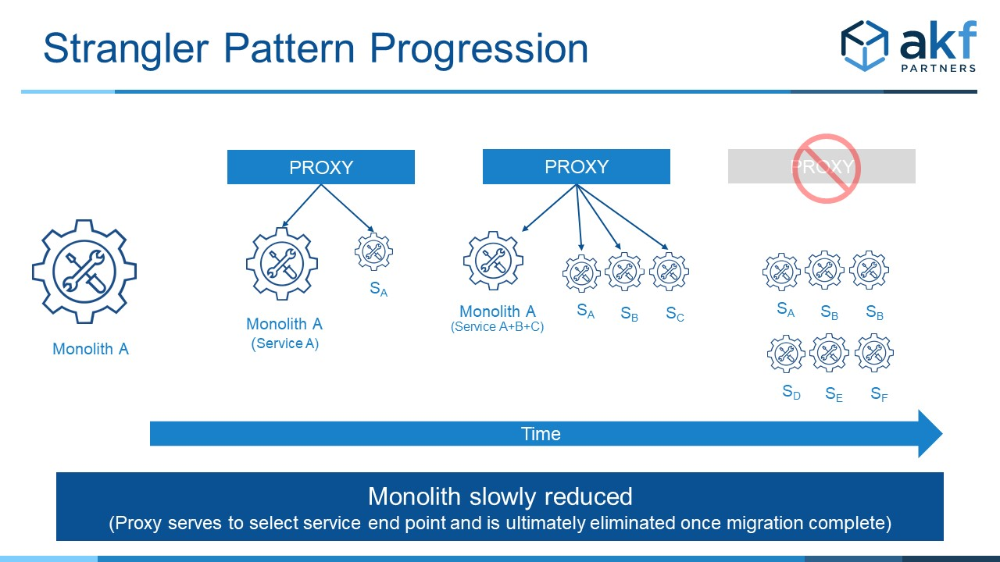
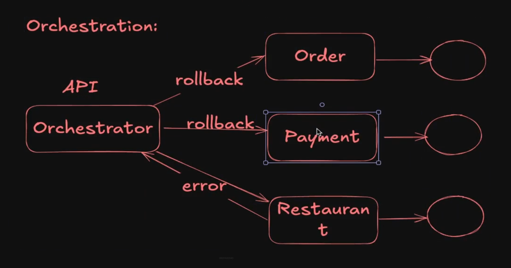
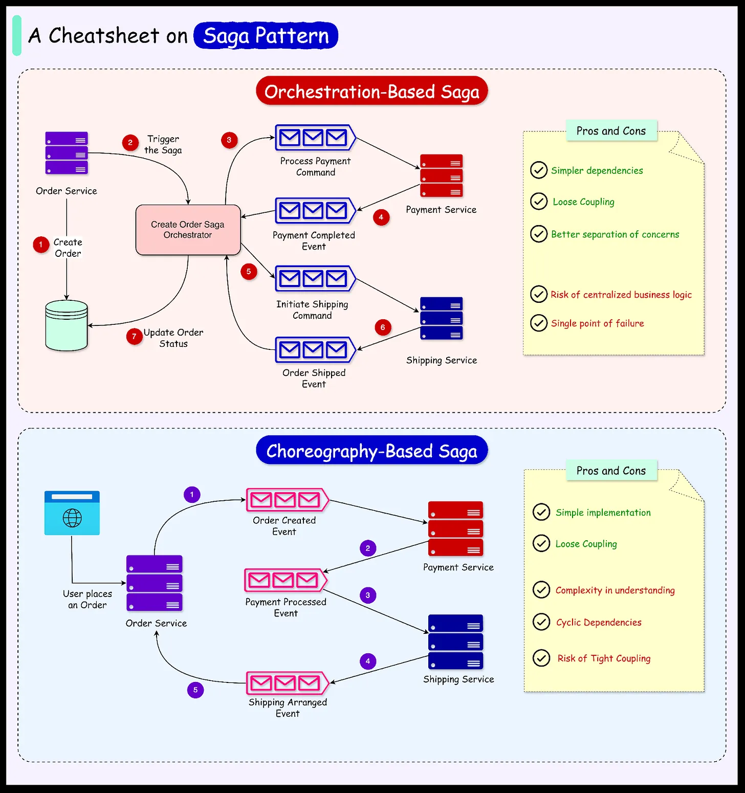
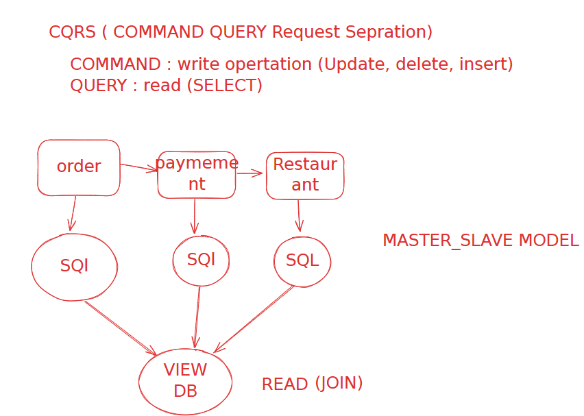
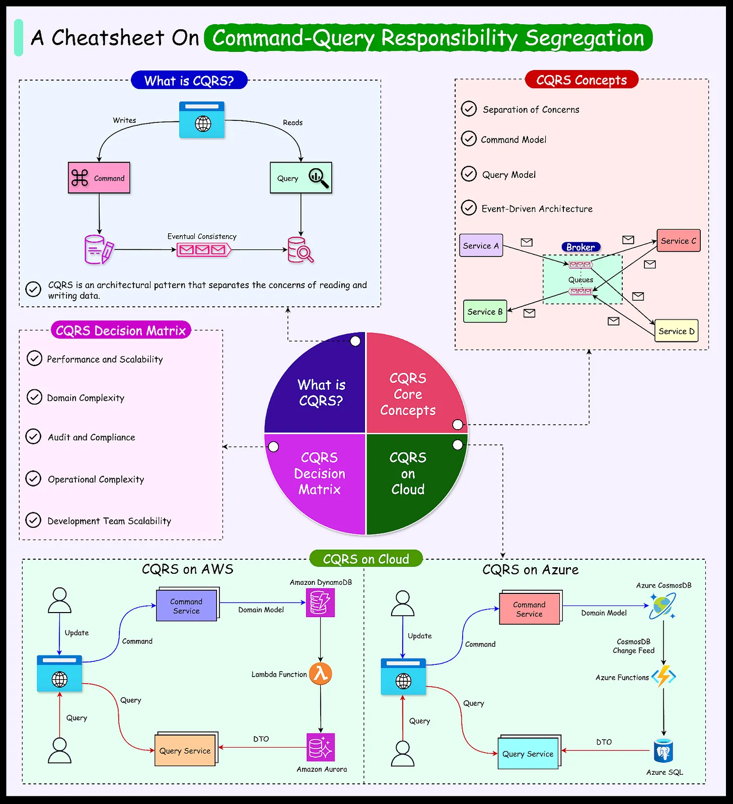

### Microservices

**Disadvantages :**

* Slow Latency
* Transaction Management Problem
* Multiple Microservices Join Problem

**Phases of Monolith to Microservices Migration :**

1. **Decomposition :** (Monolith-->Microservices) - If u have a monolith then how will you break it into a microservices architecture.
   * **Decomposition by business logic :** Divide service according to business logic

     * Disadvantage - Each developer has to be knowledge of entire business.
   * **Decomposition by Sub-domains**✔️**:** Divide Services according to modules.
   * ***Strangler Pattern:*** is Step by step decomposition while app is live. create new services step by step and diverd (small amount of requests) requests on them and go ahead with testing.

     
2. **Database** - Each Microservice can have
   * **Shared DB :**
     * A single Database will be used by all services.
     * Advantage
       * Simple to carry operations and SQL Joins
       * Easy Transaction management
     * Disadvantages
       * Can not scale properly
       * Has the limitation of either being SQL or NoSQL
   * **Unique DB :**
     * Every service can have their own database.
     * Disadvantages
       * Join Problem(solution: CQRS)
       * Transaction management problem(solution: SAGA)
3. **Communition** (API/Event Driven System)
4. **Deployment**
5. **Obesrvability**

---

##### **SAGA Pattern**

* *[Video🔗 by ByteMong](https://youtu.be/d2z78guUR4g?si=15PSAmmxz4-Etaqk)*

1. **Event Driven System/Choreography**
2. **Orchestration✔️**

   

   

---

##### **CQRS(Command Query Request Saperation)**

* [Video🔗](https://youtu.be/SvjdJoNPcHs?si=7xXudmkw3nDH7Ln1)

It divides an application into two distinct parts:

* **The Command Side:** Responsible for managing create, update, and delete requests.
* **The Query Side:** Responsible for handling read requests.
* We create a new Database(View) for read the data.

