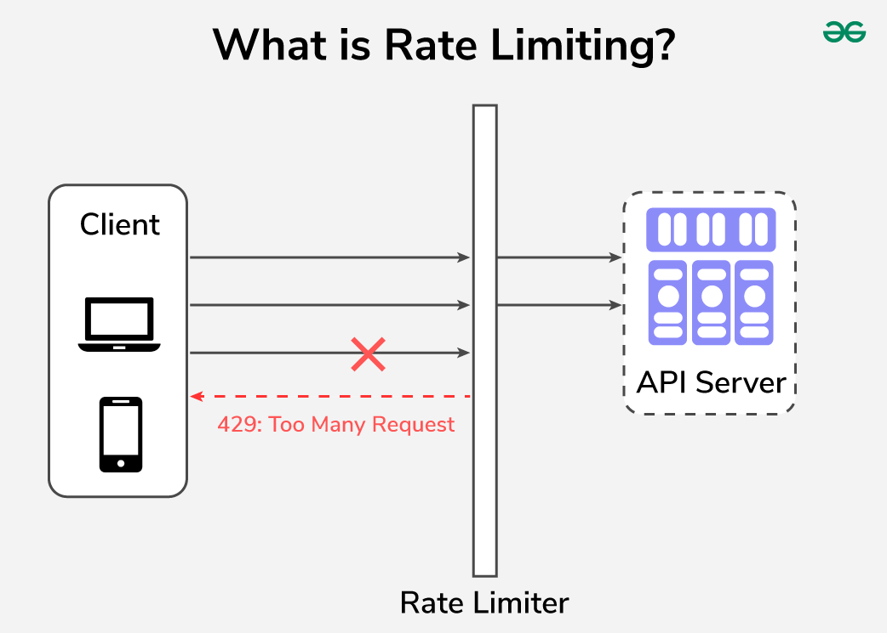

### Rate Limiting

Article : [https://bytebytego.com/courses/system-design-interview/design-a-rate-limiter](https://bytebytego.com/courses/system-design-interview/design-a-rate-limiter)

A rate limiter is a component that controls the rate of traffic or requests to a system.

* Use Cases:

  1. API Rate Limitation
  2. Web Server Raye Limitation
  3. Database Rate Limitation
* Advantages:

  1. Protects from DOS & DDOS attacks
* **Token Bucket vs Leaky Bucket :** [https://www.eraser.io/decision-node/api-rate-limiting-strategies-token-bucket-vs-leaky-bucket](https://www.eraser.io/decision-node/api-rate-limiting-strategies-token-bucket-vs-leaky-bucket)
* **Rate Limiting Algorithms**

  1. **Token Bucket :**

     * The token bucket is filled with tokens at a fixed rate, and each request requires a token to be processed. If the bucket is empty, the request is rejected.
     * The token bucket algorithm can be implemented using the following steps:
       1. Initialize the token bucket with a fixed number of tokens.
       2. For each request, remove a token from the bucket.
       3. If there are no tokens left in the bucket, reject the request.
       4. Add tokens to the bucket at a fixed rate. **LIke:** Bucket size=30; Inflow=3 tokens/second
     * **Used By** : Amazon
     * **Pros**:
       1. Simple to Implement
       2. It can handle burst traffic for small duration.
     * **Cons**:
       1. Hard to decide the bucket capacity an inflow.
     * 
  2. **Leaky Bucket(Global Rate Limiting)**

     * the bucket that will contain the incoming requests. Whenever a new request is made, it is added to the queue's end. If the queue is full at any time, then the additional requests are discarded.
     * The leaky bucket algorithm can be implemented into the following steps:

       1. Initialize the leaky bucket with a fixed size(depth) and a rate at which it leaks.
       2. For each request, add to the bucket's depth.
       3. If the bucket's depth exceeds its capacity, reject the request.
       4. Leak the bucket at a fixed rate.
     * **UsedBy :** Shopify
     * **Pros:**

       1. Simple to Implement
       2. Even though traffic is burst, our server will not crash
     * **Cons:**

       1. If DOS/DDOS happens our server misses valuable(genuine) requests. (Main Request --> Starve)
     * 
  3. **Fixed Window Counter**

     * In fixed interval (a secons or a minut) Only a specific number of request can come. When the time window expires, a new time window starts and the request limit is reset.
     * Cons:
       1. If burst traffic come at the edge of window, it may lead to server crash or high latency.
     * 
  4. **Sliding Window Log**

     * This rate limitation keeps track of each client's request in a time-stamped log. These logs are normally stored in a time-sorted **hash set or table.**
     * **Algorithm**
       1. It will store each request in a log file.
       2. Whenever a request comes, it will first removes the all outdated requests from the file.
       3. Then it will log the new request and check if the counter limit is reached drop the request else send it to server.
     * **Pros:**
       1. Best Algo for rate limiting
     * **Cons:**
       1. Strict, Slow and memory consuming
     * 
  5. **Sliding Window Counter**

     * The sliding window counters can be separated into the following concepts:
       1. Remove all counters which are more than 1 minute old.
       2. If a request comes which falls in the current bucket, the counter is increased.
       3. If a request comes when the current bucket has reached it's throat limit, the request is blocked.
     * 
     * 
