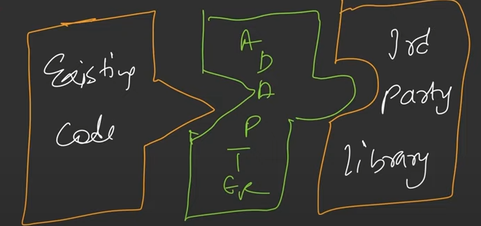
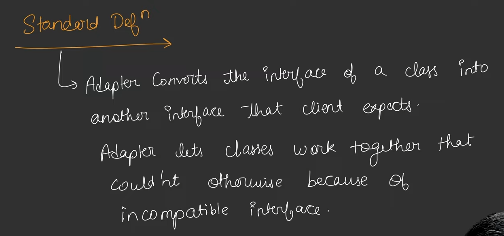
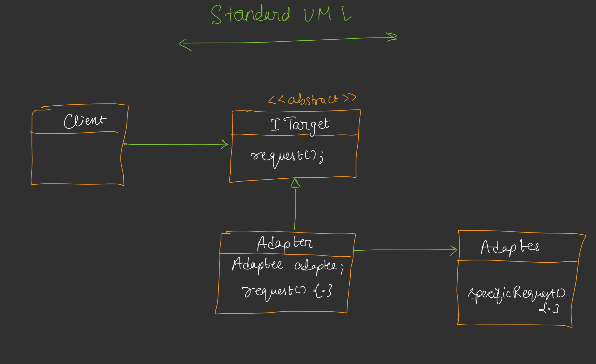
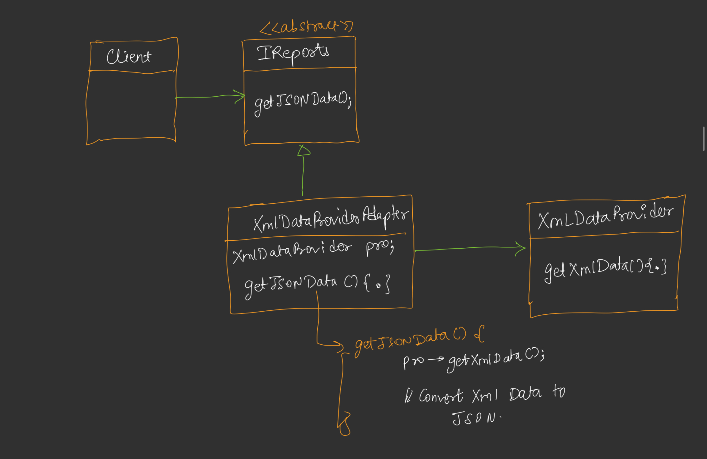

## Adapter Design Pattern

* Adapter, 2 Different Interface jinko ek dusre ke bare me kuchh bhi nhi pata, unko communicate karne me help karta hai.
* Jab hame kisi third party service/api(Like- Payment Gateway, SMS etc.) se bat communicate karna hota hai to ham Adapter ko introduce karte hain.
* Agar hame modern codebase se kisi lagecy codebase ke sath communicate karna hota hai to ham Adapter use karte hain

