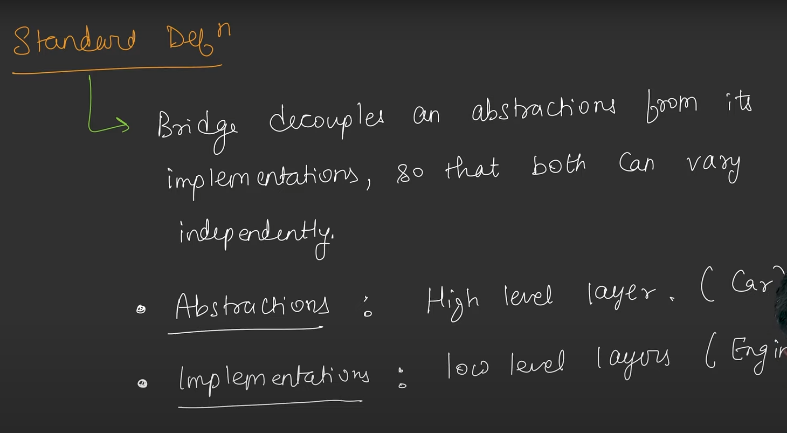

## Bridge Design Pattern

* Class Explosion: Ek hi application me ek hi feature ko implement karne ke liye bahot sari class bana di.
* Briddge Pattern helps to avoid Class Explosion.
* Bridge Pattern kahta hai, agar aapke pass concept(concept can be anything like class or object etc.) hai to aapko ise break kar dena chahiye 2 part me - HLP(High Level Part), LLP(Low Level Part).
* In the given Image Car class is HLP, and IEngine is LLP.
* Bridge Pattern is different from Strategy pattern because in Bridge  Pattern Intension is that we can add both side (HLP & LLP) more classes independently. but in Strategy Intension was We client can implement strategies and we can add more strategies independently.
* In Bridge we want any HLP concrete class can pain up with any LLP oncrete class.

