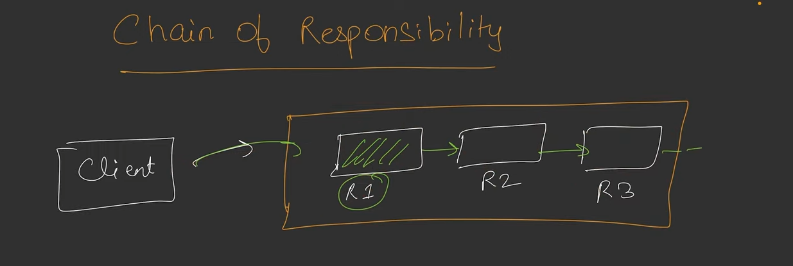
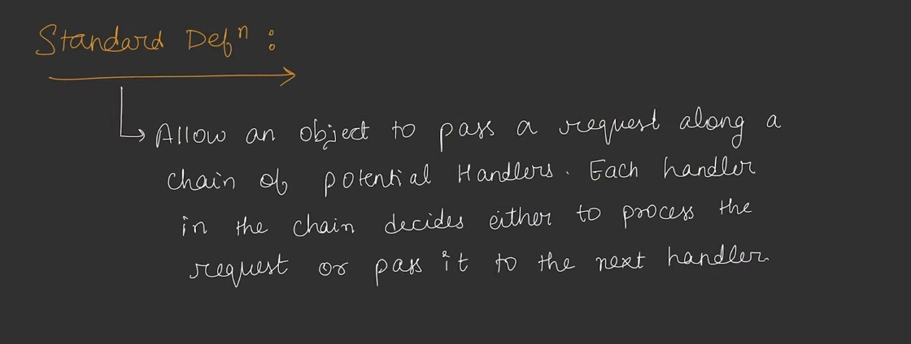
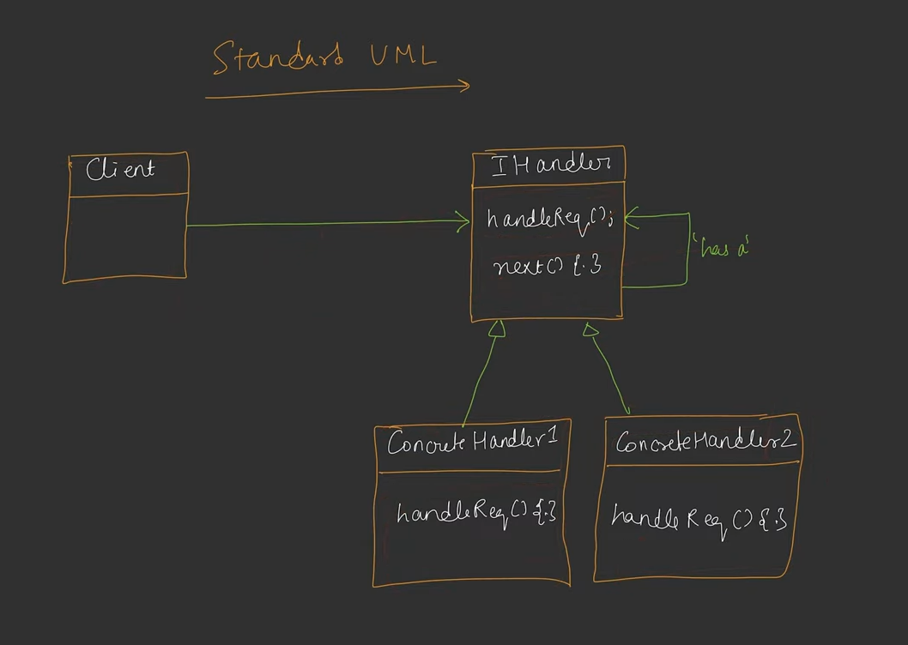

## Chain Of Responsibility

* Isame ek client, 'chain of objects' ko request bhejta hai. Jab request jayegi to first object agar request ko full fil kar sakta hai to wahi se response return ho jayega other wise first object call karega second object ko.....
* 

