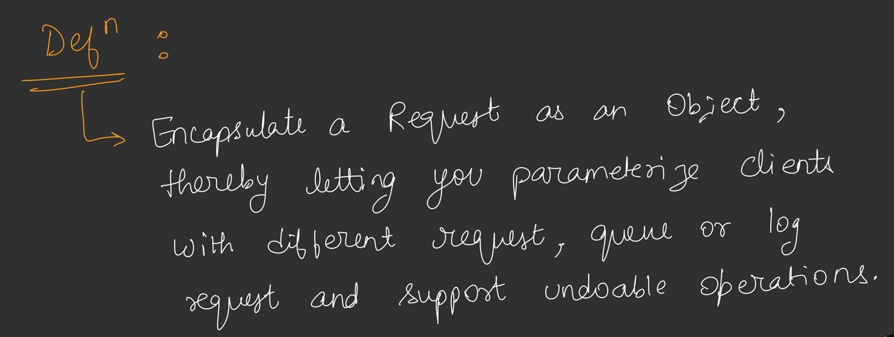
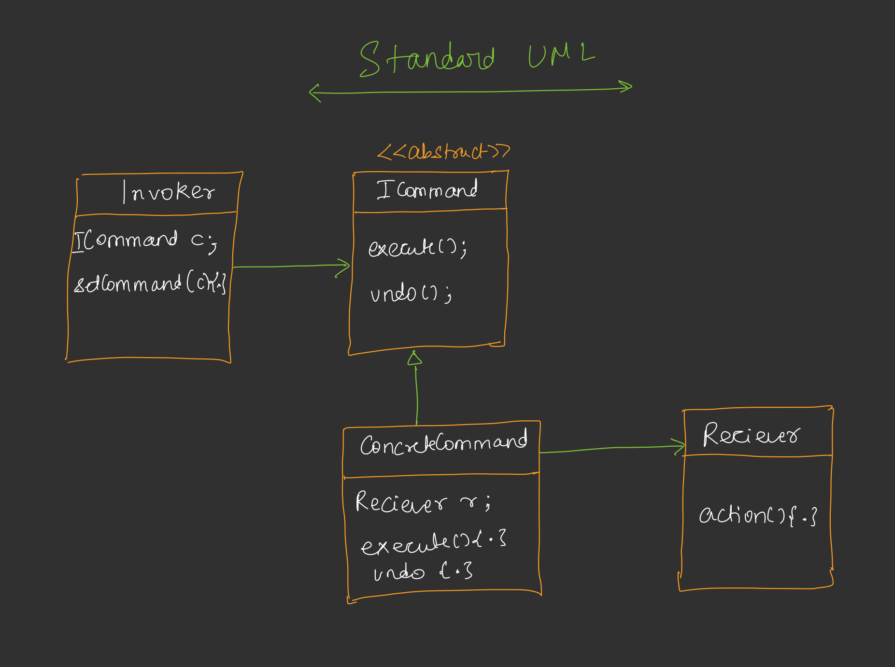
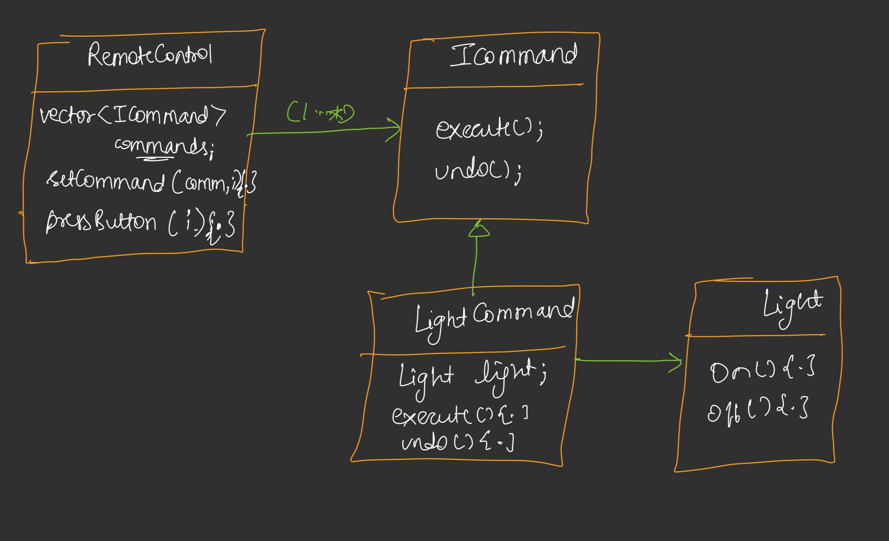

## Command Design Pattern

* Jab hame source se Reciever ko notification bhejni hoti hai koi task karwake ke liye, to ham directly reciever ki method ko call na karke bich me ek Command(Object) introduce karte hain jo reciever se communicate karta hai task complete karwane ke liye.
* Source ⇄ Command ⇄ Reciever
* Jitni bhi real world application hain jinme undo feature hota hai (Like- Text Editor etc.) unme command design pattern use hota hai.
* Keyboard shortcut me bhi Command pattern use hota hai.
* Jaha pe bhi bhi hame dynamic tasks karwane hote hain, like - abhi kuchh aur kam kar rha hai but kuchh time bad mai isko change karke kuchh aur kam karwa sakta hu, waha command pattern use hota hai.

