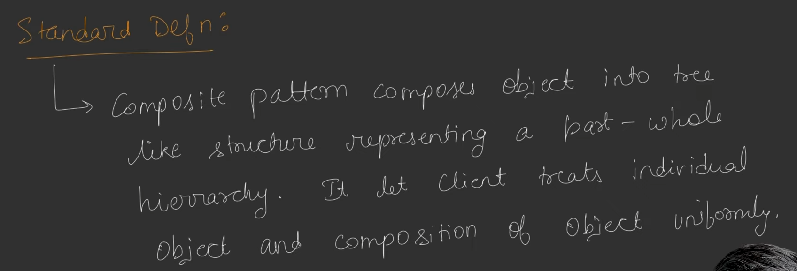
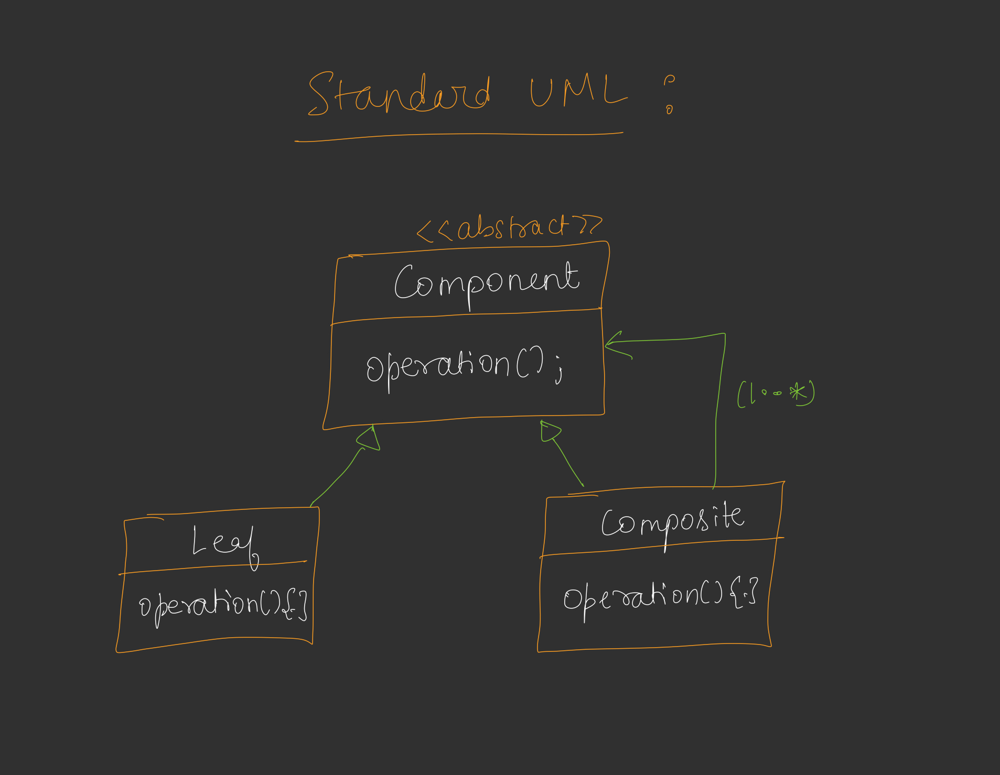
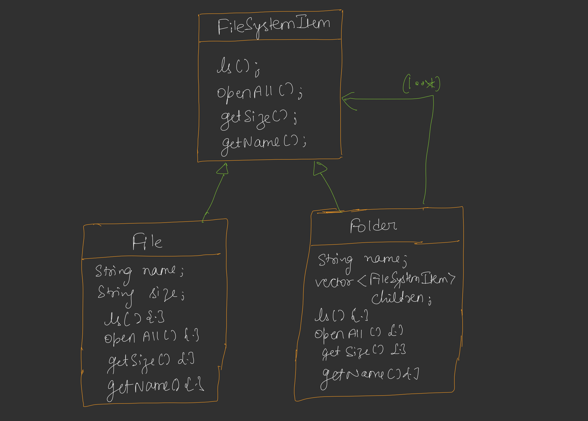

## Composite Design Pattern

* It is relatable to Tree Data Structure. Any problem which uses Tree Data Structure that can be solved through Composite Design Pattern.
* Composite Design Pattern kahta hai ki aapke pass 2 tarah ke element ho sakte hain, Composite and Leaf.
* Aur In dono ko same tarah se treat karo. Means dono ka ak common parent interface/class honi chahiye.
* Leaf ka Parent ke sath Is-a relation hota hai, and Composite ka Parent ke sath Is-a and Has-a relation hota hai.
* Composite Design Pattern ka best use file systems me hota hai.

