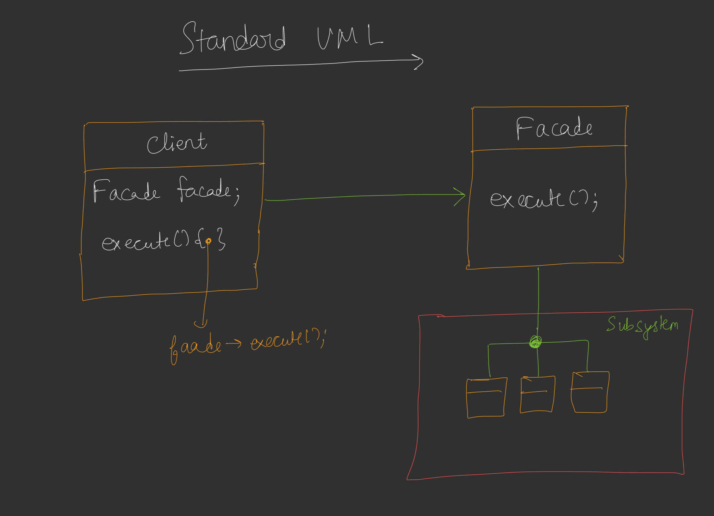

## Facade Design Pattern

* Kisi bhi client ko kisi complex subsystem se bat na karni pade isake liye Facade ek Gateway ka kam karta hai.
* Fascade, Client ko de-cupple karta hai complex subsystem se.
* Principle of least knowledge ko stablish karne me help karta hai facade design patttern.

