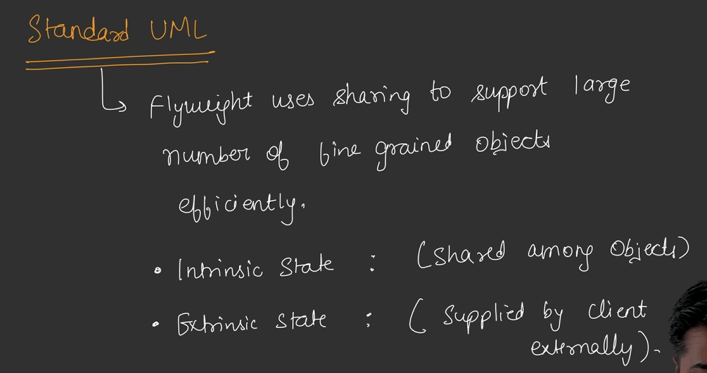
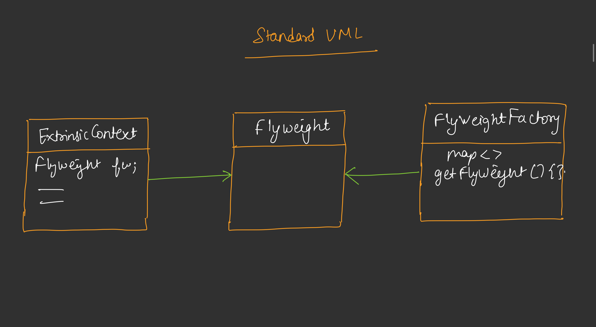

## Flyweight Design Pattern

* When we need to create multiple objects of same class with most of the similar properties then we use Flyweight Design Patterns.
* It is used in games like GTA where we need to create multiple humans objects with 80% to 90% similar properties.
* We try to create minimum objects to minimizee memory usase.

