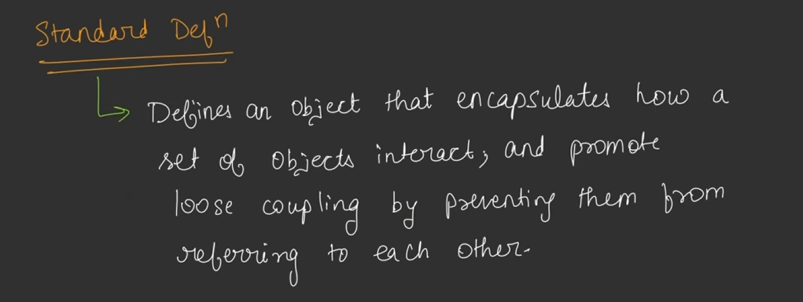
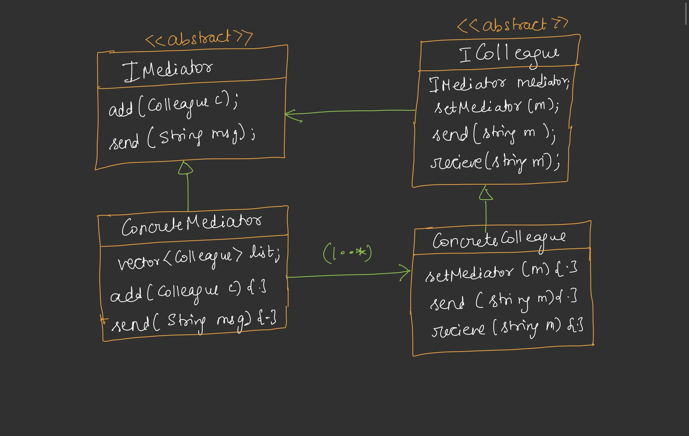

## Mediator Design Pattern

* Agar kisi Object ko kisi dusre object se communicate karna padta hai to use dusre object ka reference apne andar rakhna padta hai jisse tight coupling badhti hai and har dusre object ka reference rakhna sahi bhi nhi hai, isaliye ham is problem ko solve karne ke liye mediator design pattern ka use karte hain.
* Mediator 2 objects ke bich me communiacte karwata hai.
* Mediator use karne ke bad kisi bhi object ko kisi aur object ke bare me janne ki jarurat nhi hai. kyuki sab mediator ke through ek dusre ke intract karenge.
* 
* 

