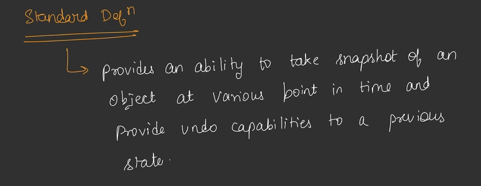
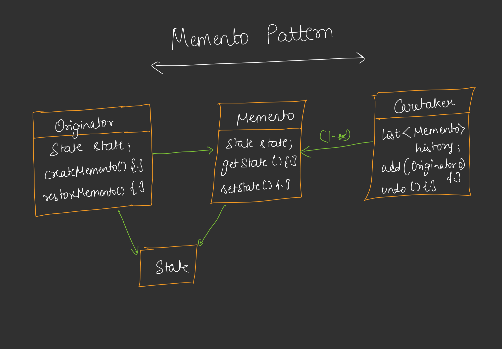

## Memento Design Pattern

* Memento Pattern Says - Agar koj object bar bar apni state change kar rha hai kisi bhi reason se to ham uski har ek state pe snapshot leke save kar lenge.
* It also used to implement undo - redo functionality etc.
* Originator : Object that state will change
* Memento : Snapshot of originator object
* Care Taker : Stores List of memento or a single memento (it used to store the memento)
* In database transaction management memento pattern is useful. because we need rollback etc. functionalities.

