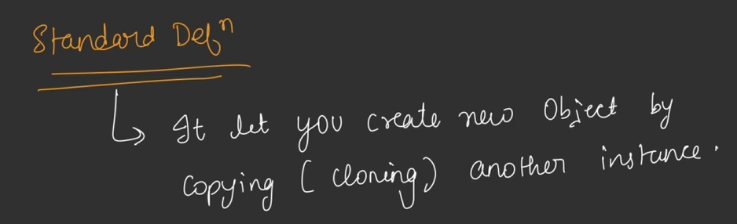
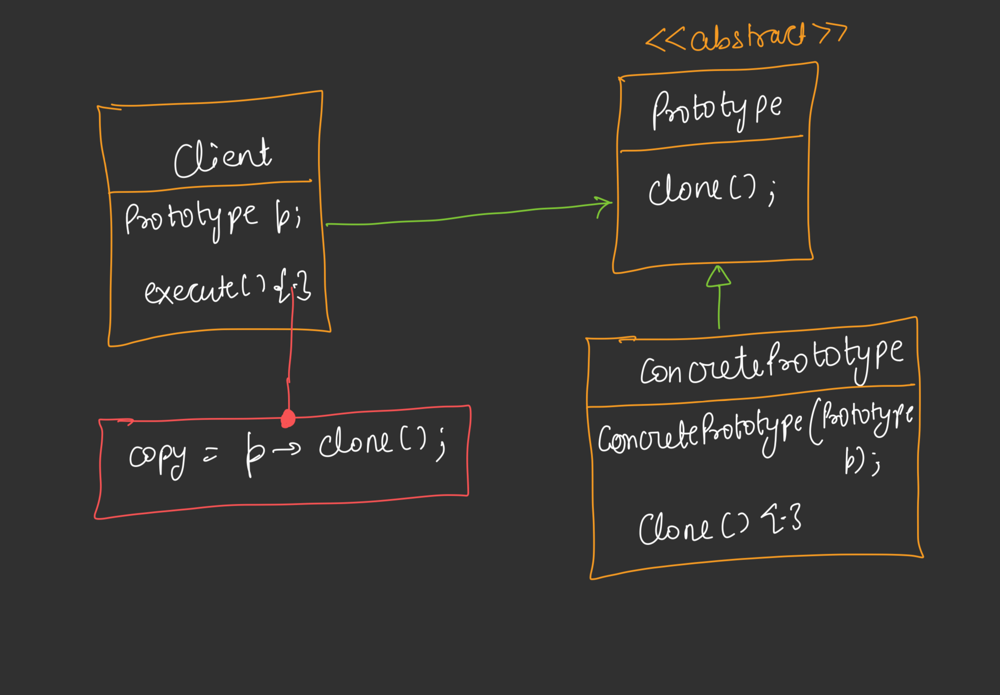

## Prototype Design Pattern

* Prototype Says - Agar aapne ek Object create kar liya hain aur aapko same features wale multiple objects chahiye to baki objects ko new keyword ke through create na karke ham first object ki multiple copies create kar lenge.
* For creating the clone(ducplicate object) we use (deep copy) copy constructor.
* Jab hame NPC's(Non Player Character's) bulk me create karne hote hain to to ham Prototype ka use karte hain.
* It used in GTA to create multiple human objects that walks on street.
* If we want to change any feature or attribute in any NPC Object then we can use getter, setters.

