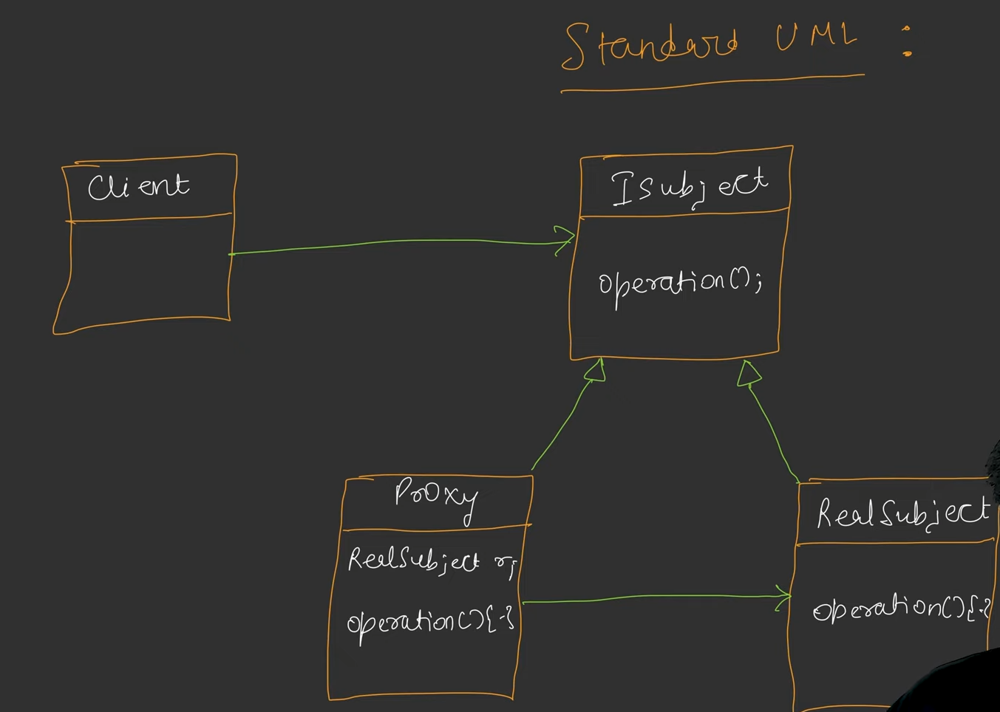
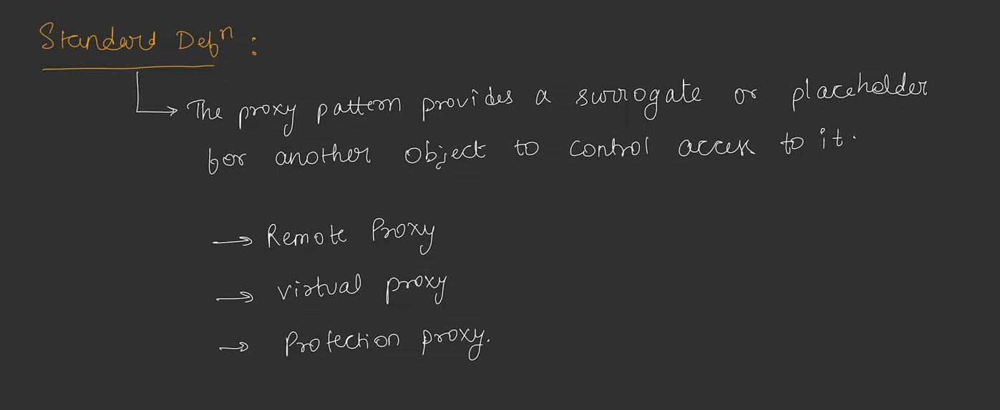

## Proxy Design Pattern

* Jab hame User se Resource ko call karna hota hai to ham directly Resource ko call na karke Proxy ko call karte hain aur Proxy Resource se communicate karke hamare request full fill karta hai. Kind of Middleware.
* **User ⇄ Proxy ⇄ Resource**
* Proxy Resource ki jaise behave karti hai isaliye user ko pata nhi chalta ki wo Resource se nhi balki Proxy se communicate kar rha hai. and also User don't hai to know that.
* Their are 3 Types of Proxy
  1. **Virtual :**
     * Used to leasy loading of any resource.
  2. **Protection  Proxy :**
     * Used to protect the Resource.
     * Like - checking the access, if user have access to get the Resource or not.
  3. **Remote :**
     * Remote proxy access the resource from remote server.
     * Remote proxy ek yese Resource ka representative banti hai jo over the internet kahin aur exist karta hoga.
* Proxy is the Representative of Resource.
* When we Implement the Primium Suscription feature in any application then when we need to check the access of feature to user then we can use Protection Proxy Design Paattern.

