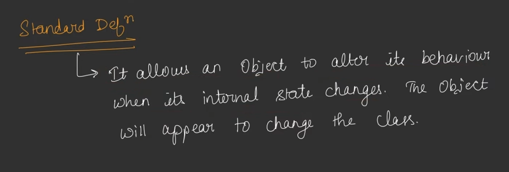
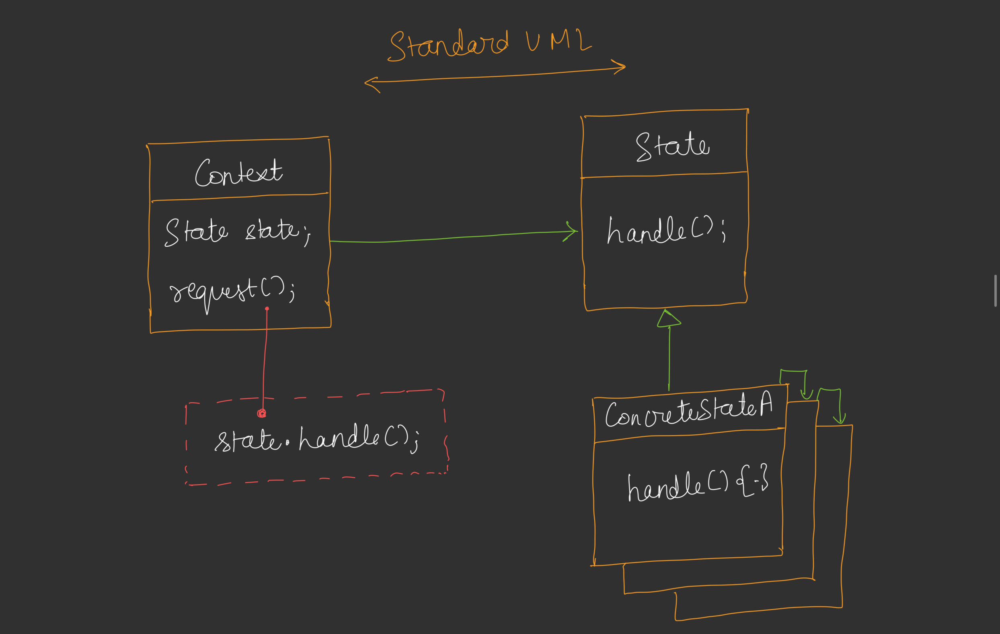
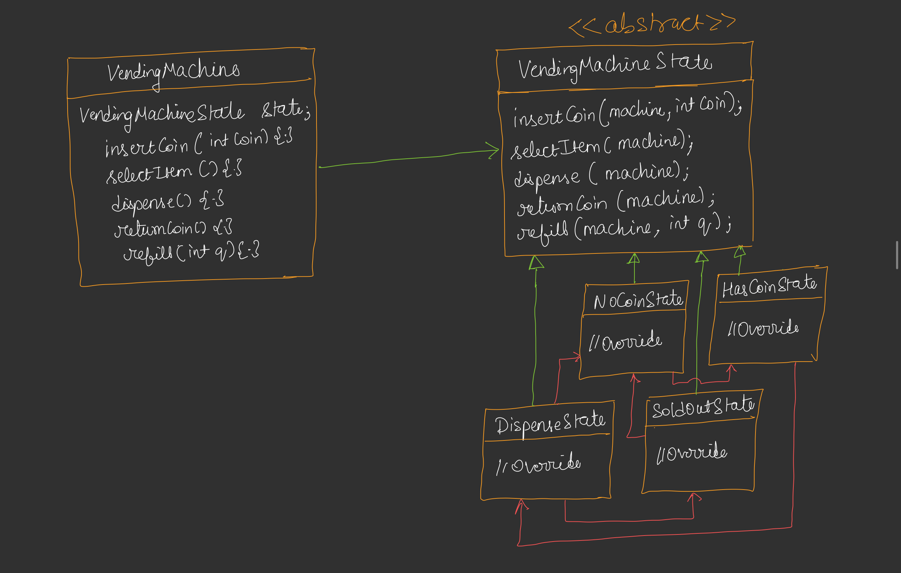
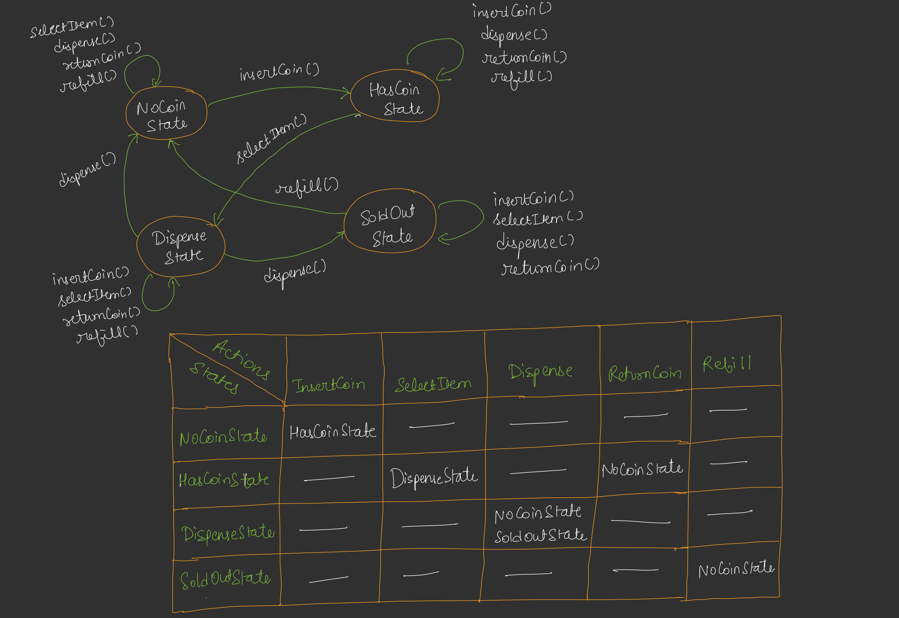

## State Design Pattern

* SMD : State Machine Diagram
* Limited Numbers of States(Objects) ho sakte hain aur limited number of methods honge.
* After executing a perticular method(performing the operation) it will change their state. if it's exucuting any other method then it's state will not change.

