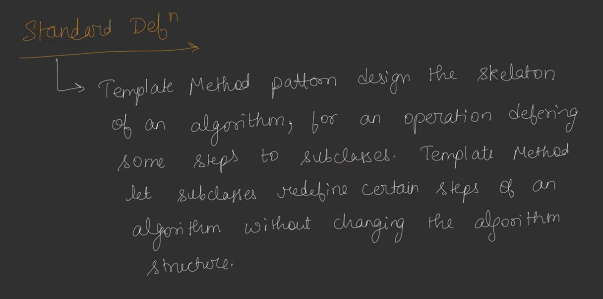
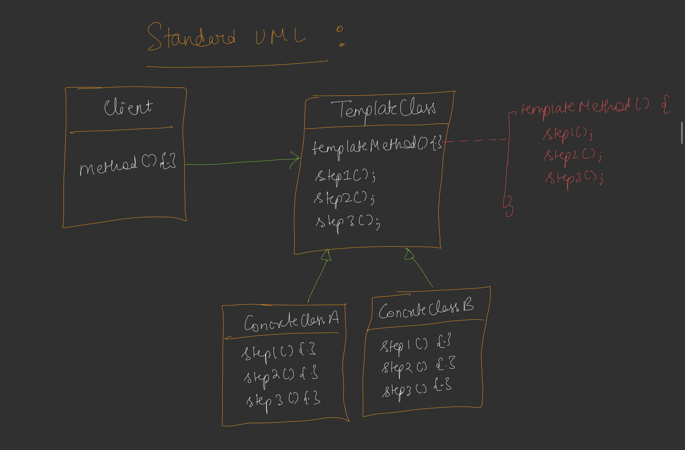

## Template Method

* Ye Pipelines create karne me help karta hai.
* Pipelines means agar ham kisi ML model ko train karte hai to hame kuchh steps ko follow karna padta hai agar sare steps ko one by one arrange kar den to ek pipeline ban jati hai.
* Agar kuchh tasks to karne ke liye bar bar same steps in an order follow karna padta hai to ham uske liye pipeline create karte hain, vecause agar ham manually har bar karenge to steps miss karne ya phir flow mistake ke chances rahte hain.
* 
* Template Method ke andar se one by one flow ke according methods ko call karte hain jisse pipeline create hoti hai.
* Concrete class ke andar ham steps ko define(override) karte hain, jo ki Template Class me already declare hoti hain.
* Agar methods common hain to ham Template Class me hi define kar dete hain.
* But Template Method ko override nhi kar sakte hain ye Template Class me hi already declare and define hoti hain.

