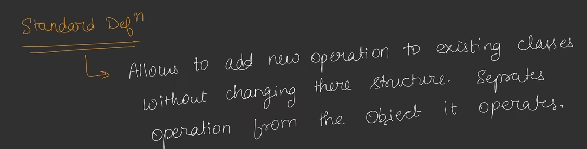
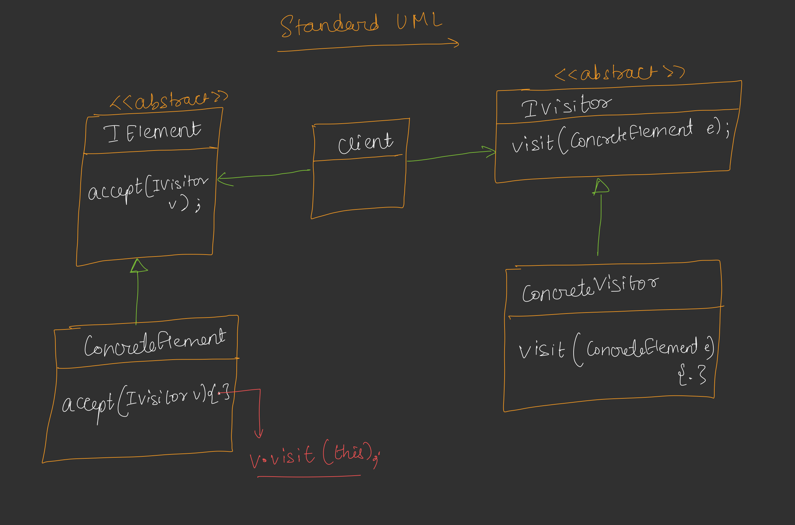
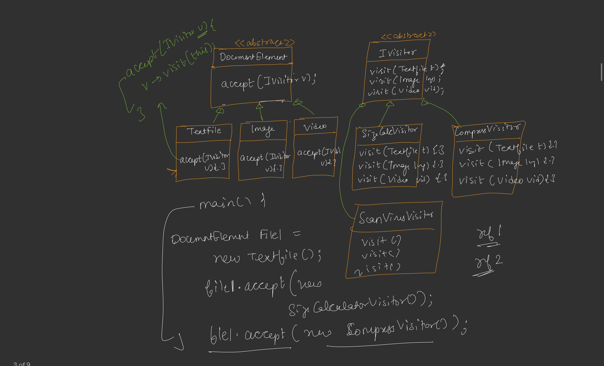

## Visitor Design Pattern

* Agar hame ek class me in future new methods add karna padta hai to bahot sare problems create hoti hain,
  Like - Open Close principle,Single Responsibility Principle ye sab break ho jate hain aur add karna bhi complex hota hai.
  to isi problem ke solve karne ke liye Visitor Design Pattern ko introduce kiya gya hai.
* Visitor Pattern Says- agar new requirements aati hain to unke same class me add na karke alag new interface and concrete classes banani chahiye.
* Double Dispatch : when two references are used to decide which method will be called.

